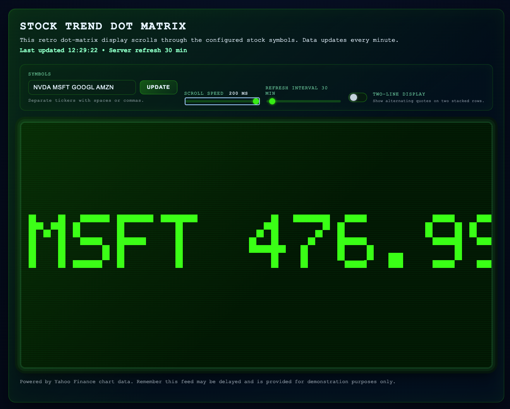

# Stock Trend CLI



A lightweight command-line helper that fetches the current stock price for a ticker symbol and prints an ASCII chart of recent daily closes. Data is retrieved directly from the Yahoo Finance chart API using Python's standard library only.

## Features

- 📈 Fetches the latest regular-market price for one or more symbols directly from Yahoo Finance.
- 📊 Renders ASCII trend charts in two styles: horizontal rows (`rows`) or vertical bars (`bars`).
- 🖥️ Optional 32×64 Tkinter dot-matrix ticker GUI via `--ticker` (with adjustable scroll speed).
- 🌐 Companion Node.js web UI with a retro pixel display and automatic browser launch.
- ⚙️ Python implementation relies only on the standard library; Node side depends on Express.

## Requirements

- Python 3.9 or newer (earlier versions may work but aren’t validated).
- Internet access (the tool queries Yahoo Finance).

## Quick start

```bash
python3 stock_trend.py AAPL
```

Example output:

```text
Current price for AAPL: 189.87 USD

5-day trend (rows):
2025-11-20 |   188.42 | ##########################
2025-11-21 |   189.12 | ############################
2025-11-22 |   189.70 | #############################
2025-11-25 |   189.87 | #############################
```

## Usage

```text
usage: stock_trend.py [-h] [-d N] [--chart {rows,bars}] [--ticker] [--ticker-speed SECONDS] SYMBOL [SYMBOL ...]
```

| Option | Description |
| --- | --- |
| `SYMBOL` | One or more ticker symbols, e.g. `AAPL MSFT TSLA`. |
| `-d`, `--days` | Number of calendar days of history to fetch (default: 5). |
| `--chart` | ASCII chart style: `rows` for horizontal bars, `bars` for a vertical bar chart. |
| `--ticker` | Launch the Tkinter-powered 32×64 dot-matrix ticker GUI. |
| `--ticker-speed` | Seconds per column shift for the ticker (default: `0.05`). |

### Examples

- Show 10 days of history with the vertical bar chart:

  ```bash
  python3 stock_trend.py MSFT --days 10 --chart bars
  ```

- Fetch two weeks of data for Tesla using horizontal rows:

  ```bash
  python3 stock_trend.py TSLA --days 14
  ```

## Web UI setup (Node.js)

Bring the retro dot-matrix experience into the browser with the self-contained web server located in `web_ticker/`.

1. **Install prerequisites**

    - Node.js 18 or newer (for built-in `fetch` and modern ECMAScript features).

1. **Install dependencies**

  ```bash
  cd web_ticker
  npm install
  ```

1. **Start the server**

  ```bash
  # Scroll AAPL, MSFT, and TSLA quotes on the display
  npm start -- AAPL MSFT TSLA

  # or run directly with a custom port
  node server.js --port 4100 GOOGL AMZN NVDA

    # refresh cached quotes every 15 minutes instead of the default 30
    node server.js --refresh 15 AMD INTC SMCI
  ```

  The server fetches quotes on demand from Yahoo Finance. When it starts it automatically opens your default browser to the local page (defaults to <http://localhost:4173/>).


  You can also configure the refresh interval via an environment variable before launch:

  ```bash
  REFRESH_MINUTES=10 npm start -- AAPL MSFT
  ```


1. **Use the API**

  The backend exposes a helper endpoint for integrations:

  ```text
  GET /api/data?symbols=AAPL,MSFT
  ```

  The response contains the latest quotes, change values, and currencies. The browser client polls this endpoint every minute and scrolls each formatted quote across a 64×32 pixelated canvas.

## Notes

- Prices are sourced from Yahoo Finance; availability or accuracy isn’t guaranteed.
- The script skips days without a reported closing price.
- For large `--days` values, Yahoo may return less data than requested depending on the ticker.

## Development

Clone the repository and create a virtual environment if desired:

```bash
python3 -m venv .venv
source .venv/bin/activate
```

Run the script locally:

```bash
python3 stock_trend.py NVDA --chart bars
```

Currently there are no automated tests, but you can verify the module imports cleanly with:

```bash
python3 -m unittest
```

## License

This project is provided under the MIT License. See `LICENSE` if present or add one that suits your needs.
