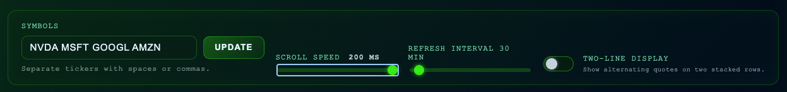

# Stock Trend CLI


A lightweight command-line helper that fetches the current stock price for a ticker symbol and prints an ASCII chart of recent daily closes. Data is retrieved directly from the Yahoo Finance chart API using Python's standard library only.

## Table of Contents

- [Features](#features)
- [Requirements](#requirements)
- [Command Line Interface](#command-line-interface)
  - [Quick Start](#quick-start)
  - [CLI Usage](#cli-usage)
  - [Command Line Options](#command-line-options)
  - [CLI Examples](#cli-examples)
- [Web UI](#web-ui)
  - [Web UI Setup](#web-ui-setup)
  - [Web UI Features](#web-ui-features)
  - [API Endpoint](#api-endpoint)
- [Notes](#notes)
- [Development](#development)
- [License](#license)

## Features

- 📈 Fetches the latest regular-market price for one or more symbols directly from Yahoo Finance.
- 📊 Renders ASCII trend charts in two styles: horizontal rows (`rows`) or vertical bars (`bars`).
- 🎨 Color-coded terminal output with the `--colour` (or `-c`) option for enhanced readability.
- 🖼️ Generate and save chart images in BMP and PNG formats with the `--save-charts` option.
- 🖥️ Optional 32×64 Tkinter dot-matrix ticker GUI via `--ticker` (with adjustable scroll speed).
- 🌐 Companion Node.js web UI with a retro pixel display and automatic browser launch.
- ⚙️ Python implementation relies only on the standard library (Pillow required for image generation).

## Requirements

- Python 3.9 or newer (earlier versions may work but aren't validated).
- Internet access (the tool queries Yahoo Finance).
- Optional: Pillow library for image generation (install with `pip install Pillow`).

---

## Command Line Interface

### Quick Start

The simplest way to use the CLI is to run the script with a stock symbol:

```bash
python3 stock_trend.py AAPL
```

Example output:

```text
Current price for AAPL: 189.87 USD

5-day trend (rows):
2025-11-20 |   188.42 | ##########################
2025-11-21 |   189.12 | ############################
2025-11-22 |   189.70 | #############################
2025-11-25 |   189.87 | #############################
```

### CLI Usage

```text
usage: stock_trend.py [-h] [-d N] [--chart {rows,bars}] [-c] 
                      [--save-charts DIR] [--ticker] [--ticker-speed SECONDS]
                      SYMBOL [SYMBOL ...]
```

### Command Line Options

| Option | Description |
| --- | --- |
| `SYMBOL` | One or more ticker symbols, e.g. `AAPL MSFT TSLA`. |
| `-d`, `--days` | Number of calendar days of history to fetch (default: 5). |
| `--chart` | ASCII chart style: `rows` for horizontal bars, `bars` for a vertical bar chart. |
| `-c`, `--colour`, `--color` | Enable colored terminal output for better visualization. |
| `--save-charts DIR` | Generate and save chart images as BMP and PNG to the specified directory. |
| `--ticker` | Launch the Tkinter-powered 32×64 dot-matrix ticker GUI. |
| `--ticker-speed` | Seconds per column shift for the ticker (default: `0.05`). |

### CLI Examples

**Basic usage - Get current price and 5-day trend:**
```bash
python3 stock_trend.py AAPL
```

**Multiple symbols:**
```bash
python3 stock_trend.py AAPL MSFT TSLA
```

**Show 10 days with vertical bar chart:**
```bash
python3 stock_trend.py MSFT --days 10 --chart bars
```

**Colorized output:**
```bash
python3 stock_trend.py AAPL --colour
```

**Generate and save chart images:**
```bash
python3 stock_trend.py NVDA -d 10 --save-charts ./output
```

**Combine multiple options:**
```bash
python3 stock_trend.py GOOGL -d 7 --chart bars --colour --save-charts ./charts
```

**Launch the Tkinter ticker GUI:**
```bash
python3 stock_trend.py AAPL MSFT TSLA --ticker
```

---

## Web UI

The web UI provides a retro dot-matrix display in your browser, perfect for monitoring stock prices with a vintage aesthetic.

### Web UI Setup

#### Step 1: Install Node.js

Ensure you have Node.js 18 or newer installed. You can check with:

```bash
node --version
```

If you need to install Node.js, visit [nodejs.org](https://nodejs.org/).

#### Step 2: Navigate to the Web UI Directory

```bash
cd web_ticker
```

#### Step 3: Install Dependencies

```bash
npm install
```

This installs the required Node.js packages (Express, etc.).

#### Step 4: Start the Server

**Basic usage - Start with default symbols:**
```bash
npm start -- AAPL MSFT TSLA
```

**Custom port:**
```bash
node server.js --port 4100 GOOGL AMZN NVDA
```

**Custom refresh interval (in minutes):**
```bash
node server.js --refresh 15 AMD INTC SMCI
```

**Using environment variable for refresh:**
```bash
REFRESH_MINUTES=10 npm start -- AAPL MSFT
```

The server will:
- Start on the default port (4173) or your custom port
- Automatically open your default browser to the web UI
- Begin fetching and displaying stock quotes
- Refresh data every 30 minutes by default (configurable)

### Web UI Features

- **64×32 Retro Pixel Display**: Authentic dot-matrix aesthetic with customizable colors
- **Automatic Scrolling**: Stock symbols and prices scroll across the display
- **Live Updates**: Data refreshes automatically at configurable intervals
- **Browser Controls**: Adjust display settings directly in the browser
- **Multiple Stocks**: Monitor multiple stocks in a continuous scroll



### API Endpoint

The web server exposes a REST API for programmatic access:

```text
GET /api/data?symbols=AAPL,MSFT
```

**Response format:**
```json
{
  "stocks": [
    {
      "symbol": "AAPL",
      "price": 189.87,
      "change": 1.45,
      "currency": "USD"
    }
  ]
}
```

**Usage in your application:**
```javascript
fetch('http://localhost:4173/api/data?symbols=AAPL,MSFT')
  .then(response => response.json())
  .then(data => console.log(data.stocks));
```

The browser client polls this endpoint every minute and displays each stock quote in a continuous scroll across the 64×32 pixelated canvas.

---

## Notes

- Prices are sourced from Yahoo Finance; availability or accuracy isn't guaranteed.
- The script skips days without a reported closing price.
- For large `--days` values, Yahoo may return less data than requested depending on the ticker.
- Image generation requires the Pillow library (`pip install Pillow`).
- The web UI requires an active internet connection to fetch stock data.

## Development

Clone the repository and create a virtual environment if desired:

```bash
git clone https://github.com/M1XZG/stock-trend-cli.git
cd stock-trend-cli
python3 -m venv .venv
source .venv/bin/activate
```

Run the CLI script locally:

```bash
python3 stock_trend.py NVDA --chart bars
```

For web UI development:

```bash
cd web_ticker
npm install
npm start -- AAPL MSFT
```

Currently there are no automated tests, but you can verify the module imports cleanly with:

```bash
python3 -m unittest
```

## License

This project is provided under the MIT License. See `LICENSE` if present or add one that suits your needs.
